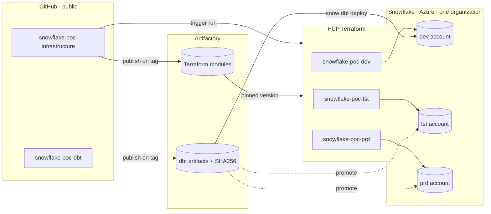
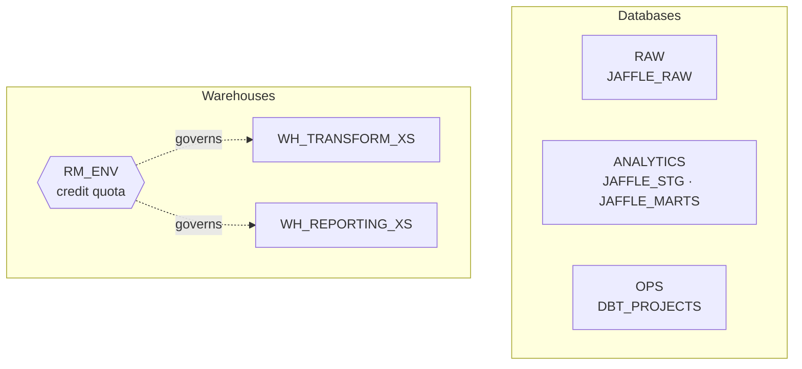
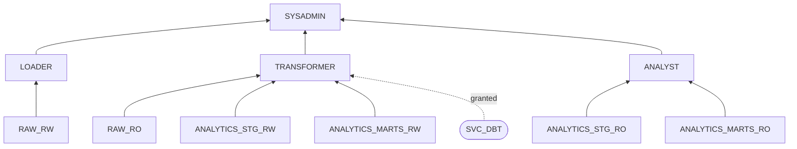

# Architecture

## Platform topology

Three separate Snowflake accounts in one organization, on Azure, in the same
region. Separate accounts rather than name-prefixed objects in one account,
which means object names are **identical everywhere** — `ANALYTICS.JAFFLE_MARTS`
in development is `ANALYTICS.JAFFLE_MARTS` in production. Promotion changes
which account is targeted and nothing else.

Terraform never touches Snowflake from the GitHub runner. Runs execute on HCP
infrastructure in Remote execution mode, so the Snowflake private key for each
account lives only in that account's HCP workspace. The runner holds an HCP API
token and nothing else.

The dbt pipeline does hold Snowflake credentials, because `snow dbt deploy`
uploads project files from the runner. Those are environment-scoped GitHub
secrets, released to a job only when it declares that environment — which is
the same mechanism that enforces the approval gate.

---

## Object model

Identical in all three accounts.

| Layer | Objects |
|---|---|
| Databases | `RAW`, `ANALYTICS`, `OPS` |
| Schemas | `RAW.JAFFLE_RAW`, `ANALYTICS.JAFFLE_STG`, `ANALYTICS.JAFFLE_MARTS`, `OPS.DBT_PROJECTS` |
| Warehouses | `WH_TRANSFORM_XS` (dbt), `WH_REPORTING_XS` (consumers) |
| Governance | `RM_ENV` resource monitor: notifies at 75% and 90%, suspends at 95%, hard-stops at 100% |

---

## Role model

Three tiers, and the rule that makes it work: **nothing is ever granted directly
to a user.**

- **Access roles** hold privileges on exactly one schema, read-only or
  read/write. Six of them, generated from a single map in
  `modules/snowflake-rbac/locals.tf`. Adding a schema means adding a map entry,
  not writing new grant blocks.
- **Functional roles** — `LOADER`, `TRANSFORMER`, `ANALYST` — are compositions of
  access roles, plus usage on the warehouse appropriate to that workload.
- **Users and services** receive functional roles only.

All functional roles roll up to `SYSADMIN`, so account administrators retain a
path to everything the platform creates without being granted objects directly.

`TRANSFORMER` additionally holds `CREATE DBT PROJECT` on `OPS.DBT_PROJECTS`,
because the dbt pipeline authenticates as `SVC_DBT` and creates the project
object itself.

In **development only**, `TRANSFORMER` also holds `CREATE SCHEMA` on
`ANALYTICS`. That single flag (`allow_developer_schemas`) is what lets engineers
build into `ANALYTICS.DBT_<USER>` and lets CI create and drop
`ANALYTICS.PR_<n>` without a Terraform round trip.

---

## Service identities

| Identity | Created by | Holds | Key lives in |
|---|---|---|---|
| `SVC_TERRAFORM` | `bootstrap/bootstrap.sql`, by hand, once per account | `ACCOUNTADMIN` | HCP workspace variable |
| `SVC_DBT` | Terraform | `TRANSFORMER` | GitHub environment secret |

Exactly one hand-made credential per account. It exists only because Terraform
cannot create the identity it uses to connect. Everything downstream of it —
including the dbt service user — is code, reviewed like code.

---

## Ownership boundary

The one place the two pipelines meet is `OPS.DBT_PROJECTS`.

Terraform owns the schema and the grants on it. The dbt pipeline owns the
`DBT PROJECT` object inside it, created by `snow dbt deploy`. The object's
lifecycle belongs to the repository that produces it, not to the repository that
provisions the container — otherwise every model change would require an
infrastructure apply.
