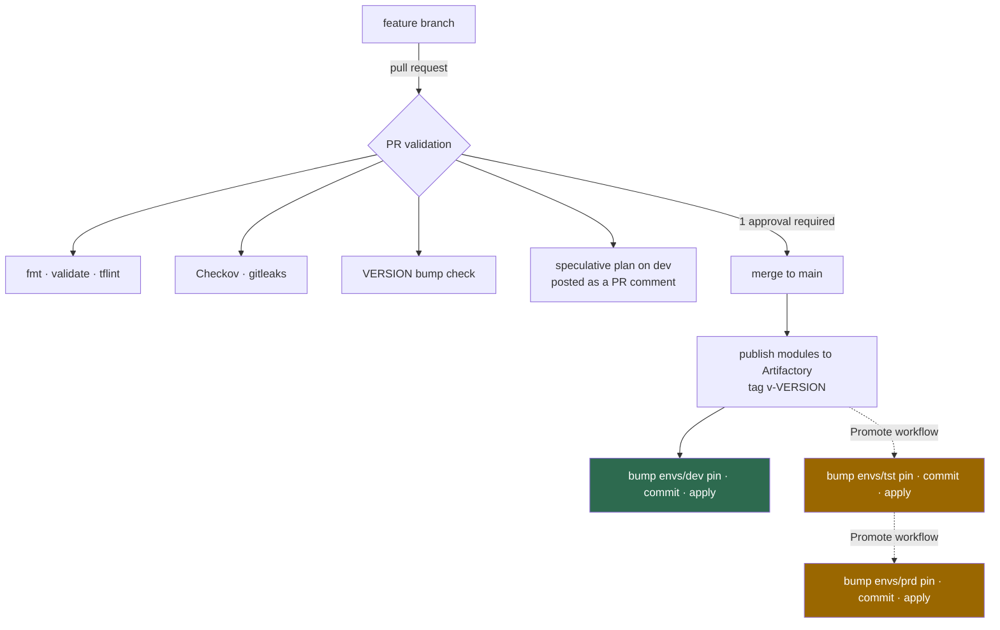
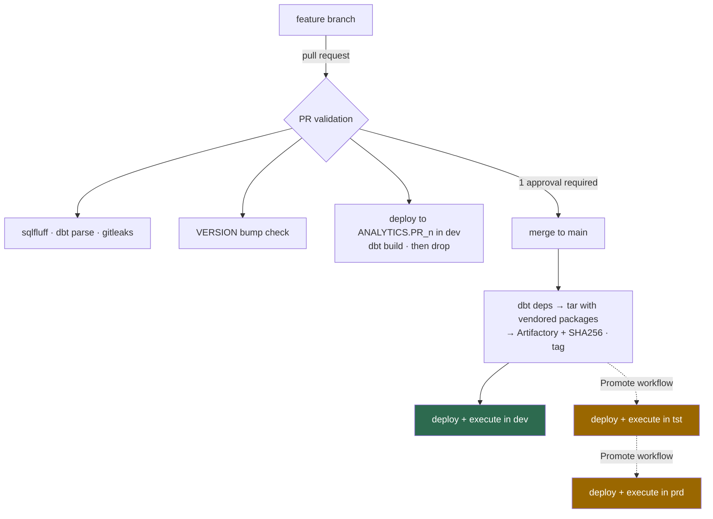

# The promotion process

Two pipelines, one shape. Both build an immutable, versioned artifact once,
then deploy that same artifact to each environment in turn. Neither pipeline
can deploy something that was not published first.

---

## Shared rules

| Rule | Why |
|---|---|
| Nothing reaches an environment except through a pipeline | Manual changes in Snowsight are invisible to review and get overwritten |
| Artifacts are immutable | A version number that can mean two different things is worthless as an audit record |
| The deployed version is committed to `main` | "What is in production?" is answered by reading the repository, not by trawling run history |
| Development deploys automatically; test and production do not | Feedback should be fast where mistakes are cheap, and deliberate where they are not |
| Promotion and rollback are the same operation | A rollback path only used in emergencies is a rollback path that does not work |

---

## Infrastructure — `snowflake-poc-infrastructure`

Dashed edges are manual, approval-gated dispatches.

The artifact is a **versioned Terraform module set**. Terraform will not accept
a variable in a module `version` argument, so each environment's pin is a
literal in `envs/<env>/modules.tf`. The deploy and promote workflows rewrite
that literal, commit it, then apply — and the commit is the audit record.

Both modules share one `VERSION`. They are designed, reviewed and promoted
together, and independent version numbers would let an environment run a
combination that was never tested as a pair.

---

## Transformation — `snowflake-poc-dbt`

The artifact is a **gzipped tarball of the dbt project with `dbt_packages/`
vendored inside it**, published alongside its SHA256. Every deployment
downloads that file and verifies the checksum before doing anything. If the
check ever fails, what is about to reach production is not what was tested.

Dependencies are resolved exactly once, on the runner. `dbt deps` inside
Snowflake would need External Network Access, which trial accounts do not have
— and vendoring is the better practice regardless, because it means the same
tarball cannot quietly resolve to different package versions six months later.

---

## Pull request validation in detail

Static checks run first and in parallel; they are fast and cost nothing. The
expensive step runs only if they pass.

**Infrastructure** ends with a speculative plan against the development
workspace, posted as a pull request comment and updated in place on each push.
Reviewers see the actual Snowflake changes, not just the diff.

**Transformation** ends with a real build. The workflow rewrites the `ci`
target's schema placeholder to `PR_<n>`, deploys the project as
`JAFFLE_SHOP_PR_<n>`, runs `dbt build` — seeds, models and tests in dependency
order — and then tears both down. Teardown runs with `always()`, and
`pr-cleanup.yml` catches cancelled runs, so an orphaned schema cannot linger.

The `generate_schema_name` macro collapses the staging and mart schemas into
the single target schema for `ci` and `sandbox` targets, so a pull request's
models physically cannot land in the shared `JAFFLE_STG` or `JAFFLE_MARTS`.

---

## Gates

| Stage | Gate |
|---|---|
| Merge to `main` | Pull request, one approval, all status checks green |
| Deploy to `dev` | None — automatic on merge |
| Deploy to `tst` | Manual dispatch of **Promote**, then approval on the `tst` environment |
| Deploy to `prd` | Manual dispatch of **Promote**, then approval on the `prd` environment |

Approvals are GitHub Environment protection rules, which are free on public
repositories. The approver is the repository owner for this PoC; in a real
deployment this would be a platform team or a change advisory group.

---

## Rollback

Run the **Promote** workflow with an older version number. There is no separate
rollback workflow because there is no separate rollback operation.

For dbt this is exact: the same bytes that ran before are redeployed, verified
by checksum. For Terraform it is an apply of the earlier module version, which
produces a real plan the approver reviews before it runs — worth reading, since
reverting infrastructure can imply destroying objects created by the newer
version.
